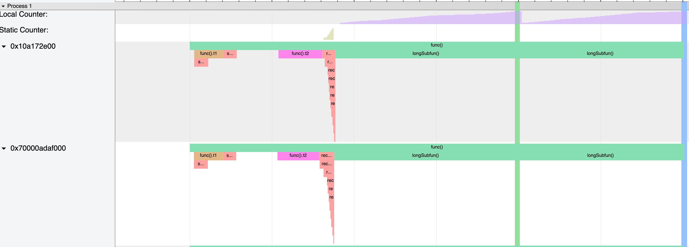

# Tractable - A lightweight C++ tracing library

Disclaimer: This library is very much WIP and everything might change with every commit.

## Dependencies

* [optional] googletest for unit tests
* [optional] google-benchmark for micro-benchmarks

## Features

### Span Tracing

```c++ 
void functionToTrace() {
    trbl::Trace t{"Func"};
    someLongCalculation();
}
```

### Counters

#### Local counter

Example:

```c++ 
void func() {
    trbl::Counter counter{"#Iterations"};
    for (size_t i = 0; i < 1000; ++i) counter.increment();
}
```

#### Static counter

Example:

```c++ 
void func() {
    static trbl::Counter counter{"#Iterations"};
    for (size_t i = 0; i < 1000; ++i) counter.increment();
}
```

#### Per-thread counter

Example:

```c++ 
void func() {
    static thread_local trbl::Counter counter{"#Iterations"};
    for (size_t i = 0; i < 1000; ++i) counter.increment();
}
```

### Events

## How to use

## Example

When using `backends/ChromeTracingBackend.h`, a json file will be written to the current working directory (Defaults to `profile.json`)

This file can be opened up in chrome using the tooling that is shipped with the browser:
[chrome://tracing](chrome://tracing)

This will show a per-thread timeline of traced functions, counters and events


